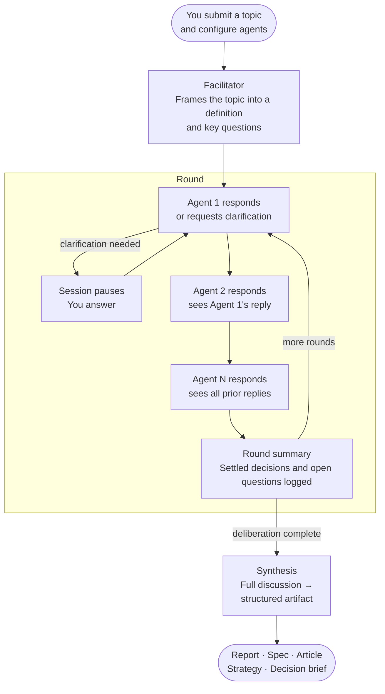

# Orchestra

Orchestra is an open-source multi-agent deliberation system. You define a topic and a set of AI agents — each with a distinct role and perspective — and Orchestra runs a structured, multi-round discussion that culminates in a polished, actionable output: an article, a technical report, a product spec, a strategy document, a decision brief, or a general summary.

It is built on [LangGraph](https://github.com/langchain-ai/langgraph) and [FastAPI](https://fastapi.tiangolo.com/), with a React web interface for real-time session management.

---

## Why Orchestra

Most AI writing tools produce a single perspective. Orchestra simulates the kind of structured deliberation that happens in expert panels, design reviews, or strategic planning sessions — where different voices challenge, refine, and build on each other's thinking before arriving at a conclusion.

The result is output that is more nuanced, better-reasoned, and less likely to miss important angles than anything a single prompt-response cycle can produce.

---

## How it works

A session moves through four stages:

**1. Framing** — A facilitator agent reads your topic and produces a precise definition along with the key questions the discussion needs to address. This grounds all subsequent deliberation.

**2. Deliberation** — Your agents speak in turn, round by round. Each agent sees what earlier speakers in the same round said, enabling genuine back-and-forth rather than isolated monologues. Between rounds, a structured summary captures settled conclusions and open questions, keeping the discussion focused without overwhelming the context window.

**3. Clarification** — Any agent can pause the session to ask you a question when it needs information only you can provide. You answer, and the session resumes exactly where it left off.

**4. Synthesis** — After deliberation ends, a synthesis agent reads the full discussion and produces a structured, formatted artifact tailored to the output type you selected.



---

## Features

- **Configurable agents** — Define any number of agents with custom names, roles, and personas. Agents can use different models, letting you balance quality and cost per role.

- **AI-assisted setup** — Not sure which agents to use? Orchestra can suggest a panel of agents based on your topic, and generate detailed personas for any role you have in mind.

- **Human-in-the-loop clarification** — Sessions are interruptible. When an agent needs your input, the discussion pauses and waits. Your answer is woven into the agent's response before the session continues.

- **Structured memory** — As rounds progress, Orchestra maintains a living record of settled decisions and open questions. Agents consult this instead of re-reading the full transcript, keeping deliberation sharp in long sessions.

- **Multiple output types** — Choose the format that fits your goal: a written piece, a technical report, a product spec, a strategic plan, a decision brief, or a general summary. The synthesis step is tailored to each format.

- **Real-time streaming** — Watch the session unfold live. Every event — framing, each agent's response, round summaries, synthesis — streams to the interface as it happens.

- **Session history** — Completed sessions are saved and can be replayed in full at any time. Export the final synthesis as Markdown or PDF.

---

## Quick start

**Requirements:** Python 3.12+, Node.js, an OpenAI API key

```bash
# First-time setup
./orchestra --setup

# Add your OpenAI API key to .env
$EDITOR .env

# Launch
./orchestra
```

The API runs on `http://localhost:7890` and the web interface opens at `http://localhost:3000`.

---

## License

MIT
